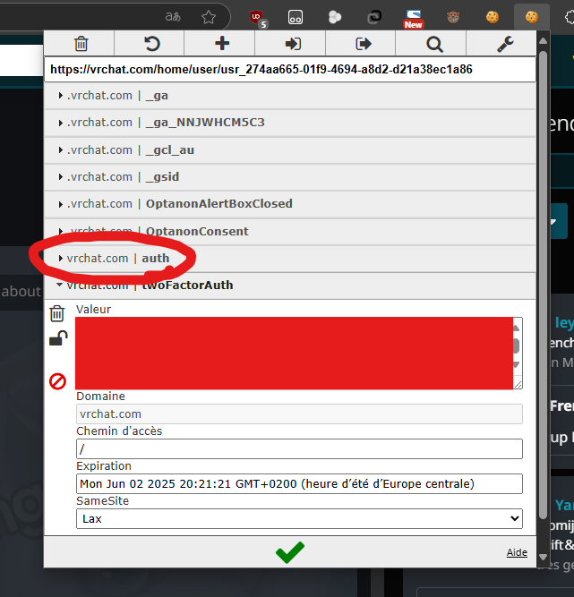
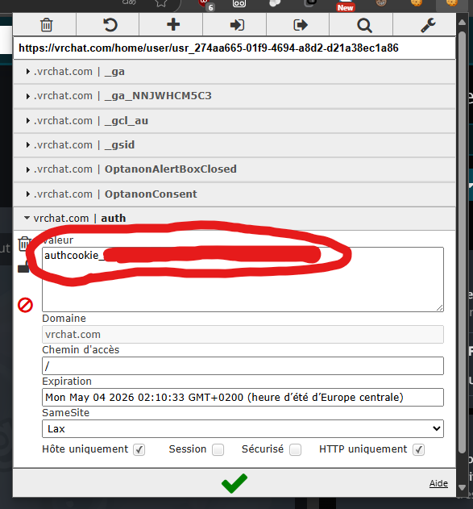
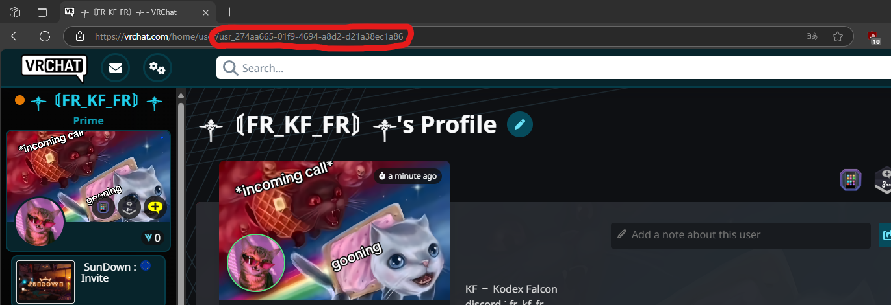

# python prismic

-search avatar Name/description
-search avatar Author
-Select avatar (Equip avatar)
-open avartar link in web
-Filter Platform PC/QUEST/IOS
-Pages
-Banned avatar count when searching (or deleted)
-loading bar (broken because of the threading)
-show curantly equiped avatar image and name

 
how to find your authcookie install this extension :

https://chromewebstore.google.com/detail/editthiscookie-v3/ojfebgpkimhlhcblbalbfjblapadhbol/reviews

 Go on the website [Vrchat home](https://vrchat.com/home)

how to find you user id:

