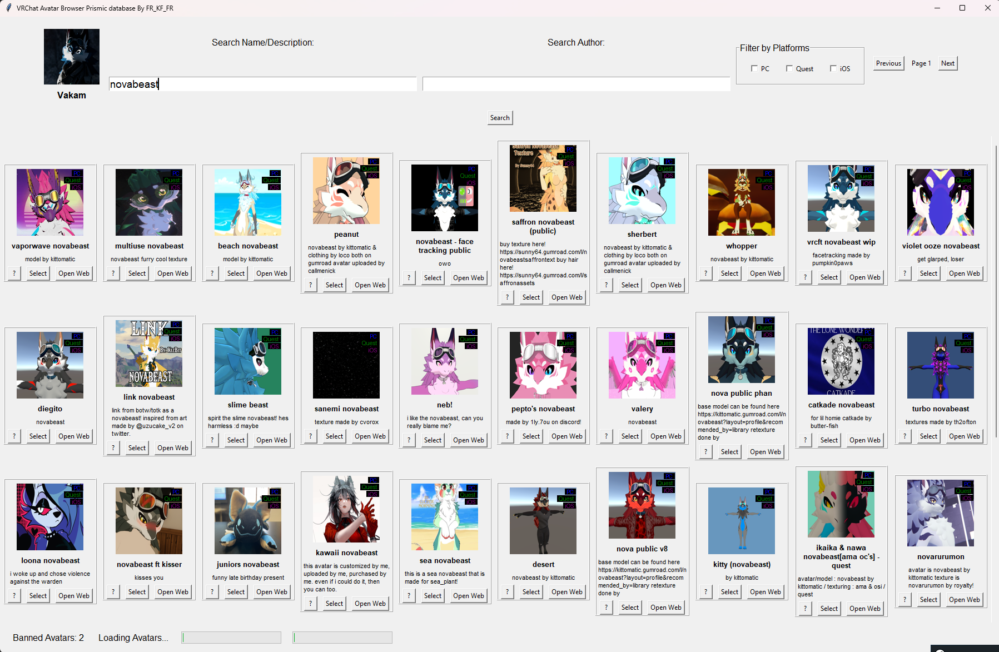

# python prismic

-NEW DATABASE SYSTEM 

-NEW DATABASE UI (WORK IN PROGRESS)

-NEW LOGIN SYSTEM 

-search avatar Name/description

-search avatar Author 

-Select avatar (Equip avatar)

-open avartar link in web

-Filter Platform PC/QUEST/IOS

-Pages

-Banned avatar count when searching (or deleted)

-loading bar (broken because of the threading)

-show curently equiped avatar image and name 

